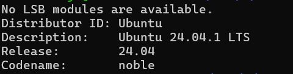
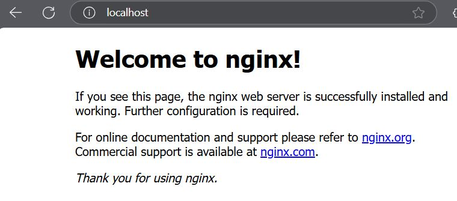
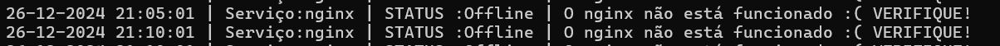
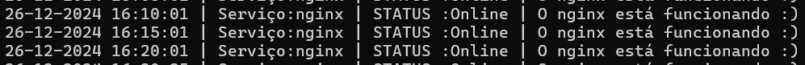

# Atividade Prática Linux - PBNOV2024
Atividade prática realizada para aplicar os conhecimentos adquiridos durante o programa de bolsas.

### Objetivos:
- Subir um servidor Nginx que deve está online e rodando.
- Criar um script que valide se o serviço 
está online e envie o resultado da 
validação para um diretório definido.
- O script deve ser personalizado e deve gerar 2 arquivos de 
saída: 1 para o serviço online e 1 para 
o serviço offline.
- O script deve ser executado de a cada 5 minutos.

## ÍNDICE
1. [Criar ambiente Linux no Windows com o WSL](#1-criar-ambiente-linux-no-windows-com-o-wsl)
2. [NGINX](#2-nginx)
3. [Criação do Script](#3-criacao-do-script)
4. [Automatizar o Script](#4-automatizar-o-script)
5. [Analisar os arquivos de log](#5-Analisar-os-arquivos-de-log)


## 1. Criar ambiente Linux no Windows com o WSL
- [Pré-requisitos] Windows 10 versão 2004 ou superior
 Para encontrar a versão do seu windows é só abrir a janela Executar do Windows e digitar "winver"
- [Instalação-WSL]
 Agora abra o Prompt de Comando do Windows no modo administrador e insira o comando wsl --install e reinicie o computador(como sugerido no terminal). Desse modo, instala o WSL2 e a distribuição padrão Ubuntu

```bash
wsl --install
```
### 1.1 Verificar a versão do Ubuntu
```bash
lsb_release -a
```



## 2. NGINX
### 2.1 Atualizar o sistema
- Verificar os arquivos que precisam de atualização
```bash
sudo apt update
```
- Atualizar os arquivos
```bash
sudo apt upgrade
```
### 2.2 Instalar o NGINX
```bash
sudo apt install nginx -y
```
### 2.3 Iniciar o servidor 
```bash
sudo systemctl start nginx
```
```bash
sudo systemctl enable nginx
```

### 2.4 Verificar Conexão
- Ir até o diretório /var/log
- Vai exibir se o nginx possui conexão com a porta :80 porta padrão do protocolo HTTP
```bash
ss -tunelp | grep :80
```
- Abre no navegador http://localhost para verificar se o NGINX está funcionado corretamente

  
 ### 2.5 Configurar permissões 
 No diretório /var/log digite o comando abaixo para definir que o dono tenha permissão total(7), grupo e usuário tenha permissão de leitura e execução(5)
 ```bash
chmod 755 nginx
```
### 2.6 Criar arquivos de log
No diretório /var/log/nginx digite os comandos
 ```bash
sudo touch serviço_on.log
```
 ```bash
sudo touch serviço_off.log
```

## 3. Criação do Script
### 3.1 Criar um diretório
 No diretório / digite o seguinte comando para criar o repositório
 ```bash
sudo mkdir scripts
```
Agora acesse o repositório
 ```bash
sudo cd scripts
```
### 3.2 Criar o script
 ```bash
sudo nano validar_serviço.sh
```
### 3.3 Escrever o script
```bash
#!/bin/bash

LOG_DIRETORIO="/var/log/nginx"

LOG_ARQUIVO_ON="$LOG_DIRETORIO/serviço_on.log"
LOG_ARQUIVO_OFF="$LOG_DIRETORIO/serviço_off.log"

DATA_HORA=$(date '+%d-%m-%Y %H:%M:%S')

SERVICO="nginx"

if systemctl is-active --quiet "$SERVICO"; then
   STATUS="Online"
   MENSAGEM="O $SERVICO está funcionando :)"
   LOG="$DATA_HORA | Serviço:$SERVICO | STATUS :$STATUS | $MENSAGEM "
   echo "$LOG" >> "$LOG_ARQUIVO_ON"
   echo "NGINX ON"
else
   STATUS="Offline"
   MENSAGEM="O $SERVICO não está funcionado :( VERIFIQUE!"
   LOG="$DATA_HORA | Serviço:$SERVICO | STATUS :$STATUS | $MENSAGEM "
   echo "$LOG" >> "$LOG_ARQUIVO_OFF"
   echo "NGINX OFF"
fi
```
### 3.4 Permissão de execução do script
 ```bash
sudo chmod +x validar_serviço.sh
```
### 3.4 Testar execução do script
Para o Nginx ativado digite
```bash
./validar_serviço.sh
```

- Para desativar o Nginx digite
```bash
 sudo systemctl stop nginx
```


## 4. Automatizar o Script
### 4.1 Crontab
```bash
sudo crontab -e
```
### 4.2 Executar a cada 5 minutos
Abaixo da última linha do arquivo digite o comando abaixo, para automatizar o script
```bash
*/5 * * * * /scripts/validar_serviço.sh
```
### 4.3 Verifique se o comando foi escrito corretamente
- Digite o comando abaixo para visualizar a tarefa configurada no crontab
```bash
crontab -l
```
## 5. Analisar os arquivos de log
### 5.1 Logs OFF
- Visualizar os logs de saída para o serviço offline
```bash
 cat /var/log/nginx/serviço_off.log
```

### 5.1 Logs ON
-- Visualizar os logs de saída para o serviço online
```bash
 cat /var/log/nginx/serviço_on.log
```


